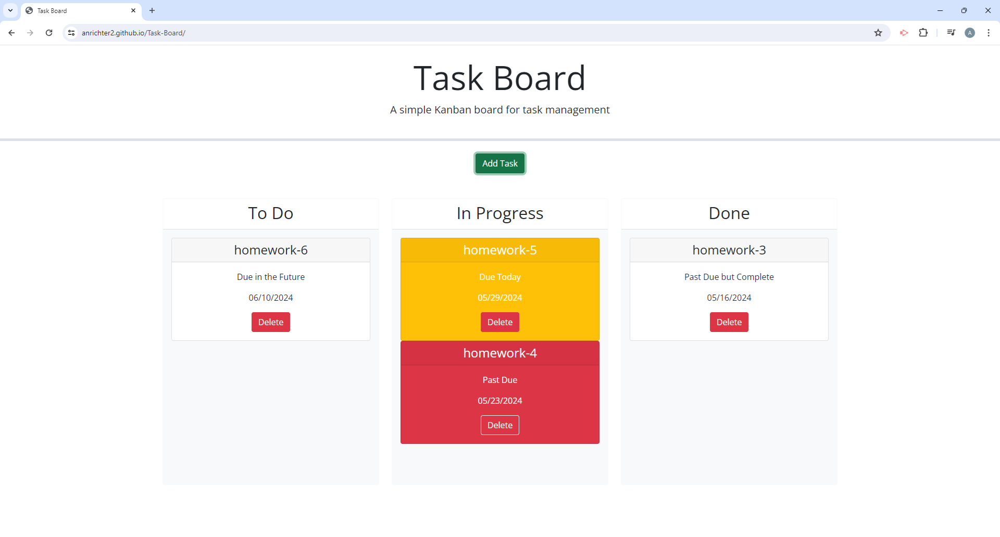
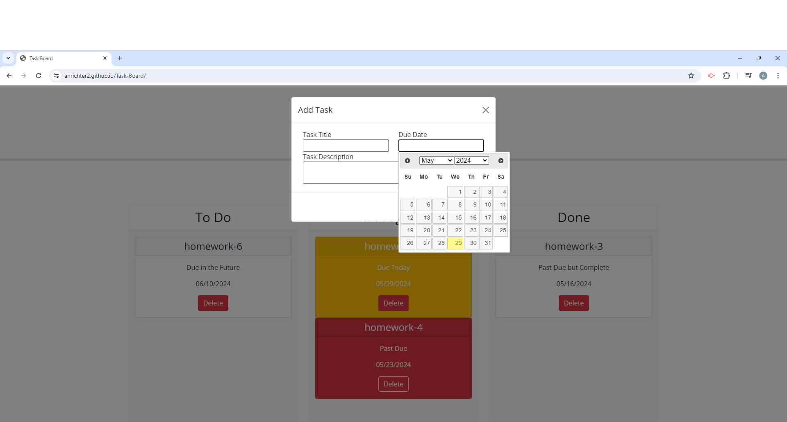

# Task-Board

## Description

For this project a project manager wanted me to create a simple task management application. The application would utilize jQuery and bootstrap to dynamically update the HTML and CSS of the webpage, and allow the project manager to track the overall progress of each task item.

## Installation

N/A

## Usage

Below are screenshots showing my task board website.

Link to the deployed webpage
[My Task Board](https://anrichter2.github.io/Task-Board/)

## Credits

This project is very similar to an in class mini project so there might be some code overlap.

## License

N/A
